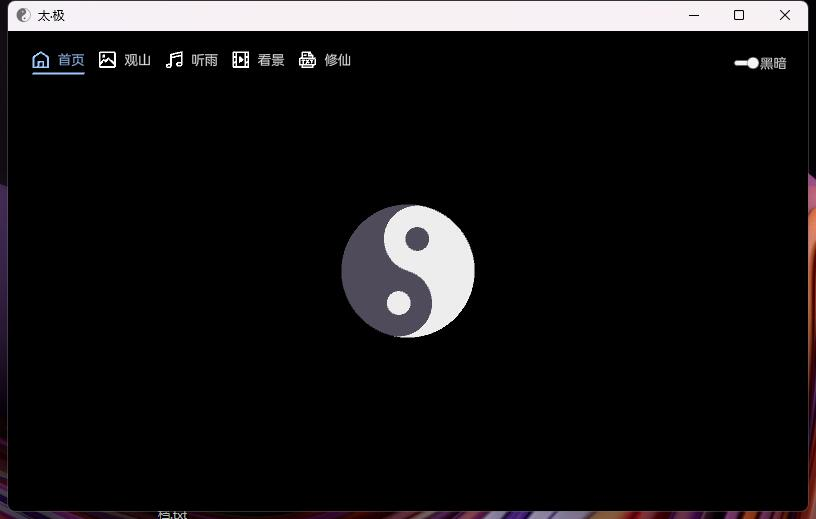
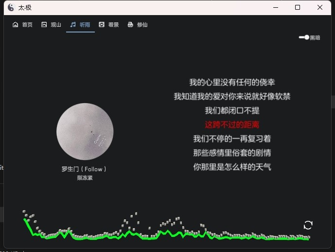
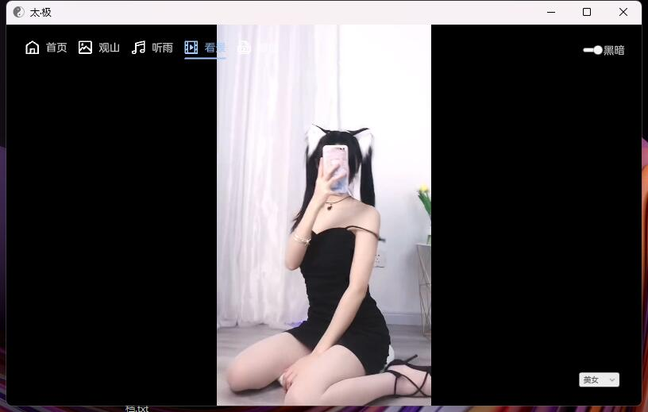

# TaiChi

#### 名称
太·极 Unity摸鱼软件 

#### 说明

1.  创意源自 https://github.com/cuifengcn/TAICHI-flet
2.  当前Unity版本 Unity 2021.3.12f1c2
3.  图片视频API来自 https://api.aa1.cn/
4.  图标来自 https://iconpark.oceanengine.com/official
5.  功能未完成

#### 警告

1.  数据均来源于网络，与本人无关！请自行判断数据的准确性！
2.  项目仅用于学习，请勿用于商业目的

#### 效果图

#### 参与贡献

1.  Fork 本仓库
2.  新建 Feat_xxx 分支
3.  提交代码
4.  新建 Pull Request

#### 特技

1.  使用 Readme\_XXX.md 来支持不同的语言，例如 Readme\_en.md, Readme\_zh.md
2.  Gitee 官方博客 [blog.gitee.com](https://blog.gitee.com)
3.  你可以 [https://gitee.com/explore](https://gitee.com/explore) 这个地址来了解 Gitee 上的优秀开源项目
4.  [GVP](https://gitee.com/gvp) 全称是 Gitee 最有价值开源项目，是综合评定出的优秀开源项目
5.  Gitee 官方提供的使用手册 [https://gitee.com/help](https://gitee.com/help)
6.  Gitee 封面人物是一档用来展示 Gitee 会员风采的栏目 [https://gitee.com/gitee-stars/](https://gitee.com/gitee-stars/)
