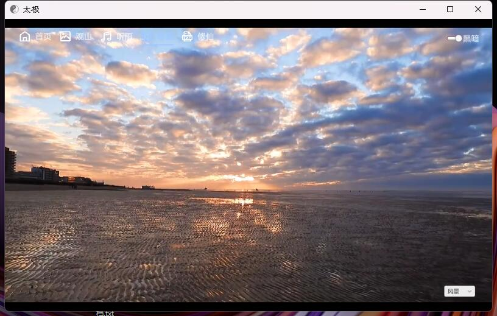

# TaiChi

#### 名称
太·极 Unity摸鱼软件 

#### 说明

1.  创意源自 https://github.com/cuifengcn/TAICHI-flet
2.  当前Unity版本 Unity 2021.3.21f1c1
3.  图片视频API来自 https://api.aa1.cn/
4.  图标来自 https://iconpark.oceanengine.com/official
5.  功能未完成

#### 警告

1.  数据均来源于网络，与本人无关！请自行判断数据的准确性！
2.  项目仅用于学习，请勿用于商业目的

#### 效果图

#### 参与贡献

1.  Fork 本仓库
2.  新建 Feat_xxx 分支
3.  提交代码
4.  新建 Pull Request  